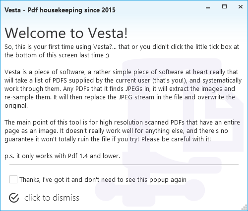
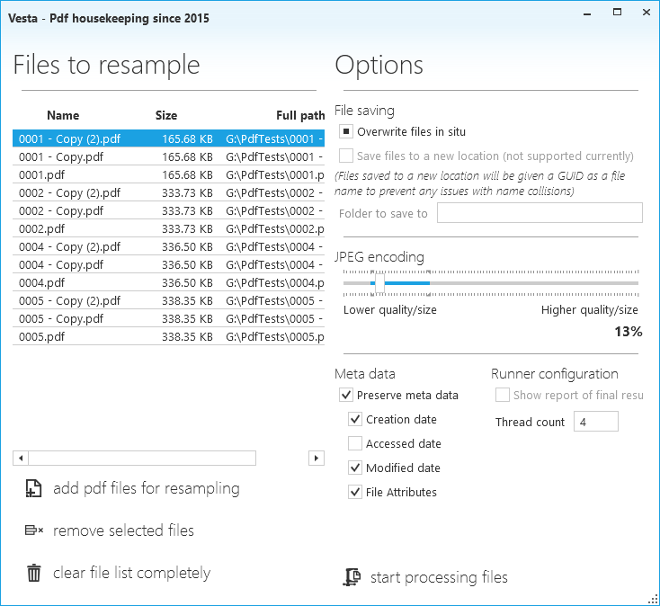
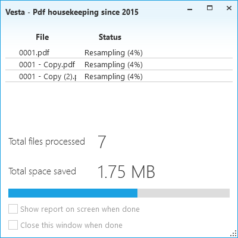

# Vesta
## In-file JPEG re-encoding with variable quality for PDF &lt;=1.4

Vesta is a small project with a pretty narrow purpose.  It can take a number of PDF files and allow the user to specify an encoding quality level for all JPEGs within those files.  All output files will be PDF 1.4 or lower, regardless of their starting version.

###Screenshots

**Obligatory initial annoying popup window**

------

**Main window that user can drag and drop files and/or folders into, or select them manually**

------

**Processing window that displays progress to user**

